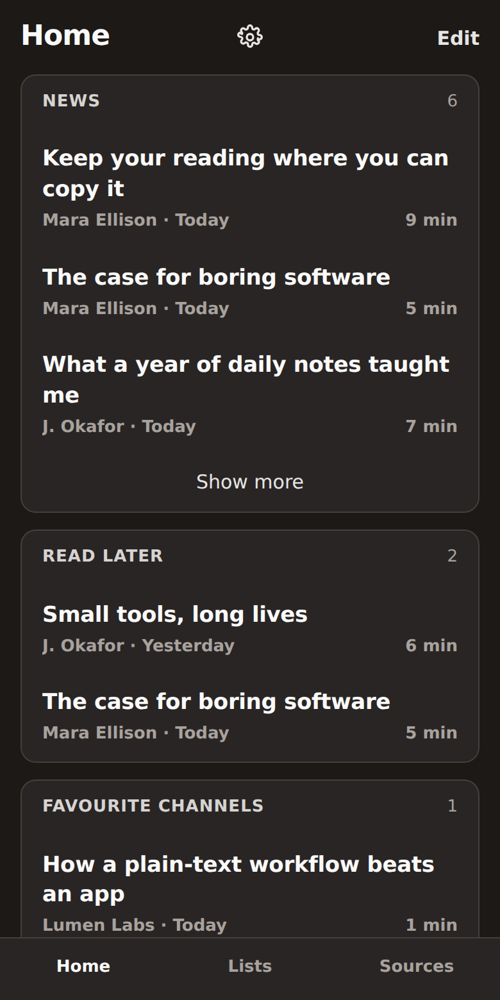
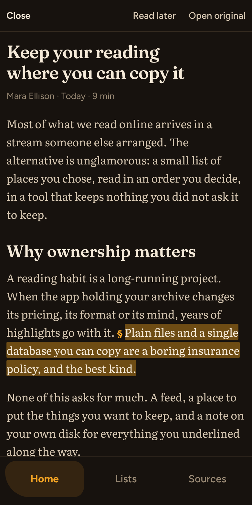
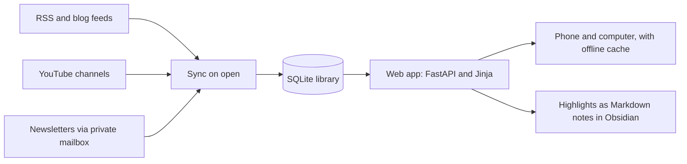

# Reader

[](https://github.com/GabZech/reader/actions/workflows/test.yml)

**A personal reading hub for one person: newsletters, feeds, and saved articles in one place you own, with highlights that flow straight into Obsidian.**

<p align="center">
  
  &nbsp;&nbsp;
  
</p>

The screenshots show demo content, not a real library.

## Why it exists

Reading apps tend to hold your archive hostage. Years of saved articles and highlights live in someone else's database, in a format you cannot easily leave with, and they stay only as long as the company does.

Reader starts from the opposite end: **the reading is yours, and so is everything you do with it.**

- **One library, one file.** Sources, articles, and highlights live in a single SQLite file you can copy, back up, or move to another machine. No vendor-only data plane.
- **Highlights leave as plain Markdown.** Each article's highlights become a note in your Obsidian vault, so your thinking ends up where you already do it, not locked inside a reading app.
- **One reader, on purpose.** No accounts, no sharing, no feed algorithm. That keeps the app small, and the whole library yours.
- **Runs anywhere Docker does.** It is deployed on a small always-on host today, and moving it is an image plus a file.

## What it does

- **Brings everything into one place.** RSS and blog feeds, YouTube channels (regular videos, never Shorts), and newsletters through a private mailbox.
- **Organises with lists.** Sources can sit on several lists at once, and Home shows only what is unread.
- **Saves for later.** Send any link to Read later, pick up where you left off, and archive when done.
- **Reads comfortably.** Swipe a row to mark it read or delete it, and videos play inside their own page with their length shown.
- **Highlights, including images,** with section titles that travel with them, exported to Obsidian roughly one commit per article.
- **Keeps working offline.** It is an installable web app (PWA), so anything already opened stays readable without a connection.

## How it works



**Stack:** Python, FastAPI, Jinja templates, a little page JavaScript, SQLite, [trafilatura](https://github.com/adbar/trafilatura) for cleaning article HTML, Docker, and Fly.io.

**Tradeoffs we chose on purpose** (the full list is in [architecture](docs/architecture.md)):

- **Control over convenience.** Article cleanup is our own code and the database is a plain file, instead of a rented database or paid extractor.
- **A web app, not a store app.** One codebase for phone and computer and no App Store fee, at the cost of a native iPhone app.
- **Python and HTML over a heavy JavaScript client,** which keeps the code small and readable.

A highlighted article exports as a note like this:

```markdown
---
author: Mara Ellison
published_date: 2026-09-30
source: https://example.org/a1
---
# Keep your reading where you can copy it

## Highlights
### Ownership

- Plain files and a single database you can copy are a boring insurance policy, and the best kind.
```

## Run it locally

You need [uv](https://docs.astral.sh/uv/). From the repo root:

```text
uv sync
uv run pytest
uv run uvicorn app.main:app --port 8000
```

Then open [http://127.0.0.1:8000](http://127.0.0.1:8000). The tests include browser-driven ones, so they need Chromium (`uv run playwright install chromium`). Config names, the lint command, and Docker are in [development](docs/development.md).

## How it is developed

This repo is built with AI coding agents, under rules meant to keep them honest. Work moves one change at a time through a fixed loop: frame, shape, preview the look, build, try it on the live app, ship. A behaviour change starts with a failing test, nothing merges without the owner trying it live, and every change goes through a pull request.

The rules are in [AGENTS.md](AGENTS.md), and [HARNESS.md](HARNESS.md) explains how that setup is put together.

## Where to look next

- **[PROGRESS.md](PROGRESS.md):** what is in flight right now.
- **[Roadmap](docs/roadmap.md):** what is built and what is next.
- **[Architecture](docs/architecture.md):** the running system, what we build, what we rent, and the tradeoffs accepted.
- **[Development](docs/development.md):** running the app and the tests on your machine.
- **[Operations](docs/operations.md):** hosting, backup of the library file, and the cost ceiling.
- **[UI guidelines](docs/ui-guidelines.md):** the look the screens follow.
- **[Docs index](docs/README.md):** everything else.
